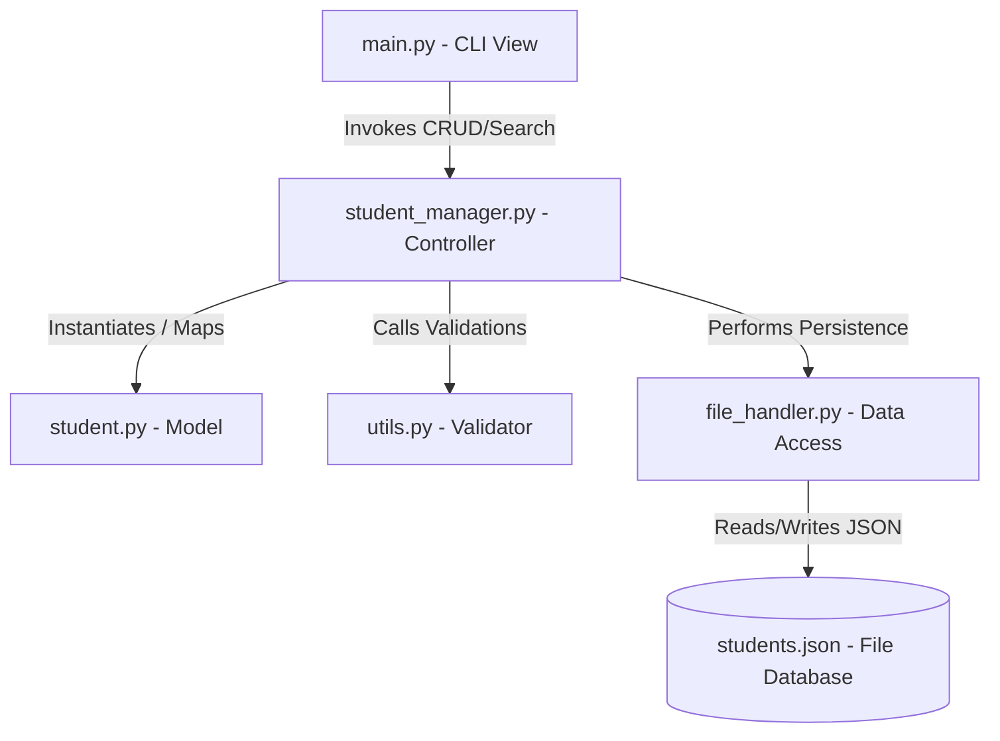

# INTERNSHIP PROJECT REPORT

**Task Name**: Task 1: Student Management System  
**Internship Domain**: Python Development Internship  
**Applicant Name**: SESHA S  
**Application ID**: KTS020260716704  
**Internship Duration**: 30 Days (20 July 2026 – 19 August 2026)  
**Host Organization**: Kinetrexa Software Private Limited  

---

## 1. Title Page & Project Identification
- **Project Title**: Production-Quality CLI Student Management System
- **Company**: Kinetrexa Software Private Limited, Gorakhpur, UP
- **Student ID**: KTS020260716704
- **Date of Submission**: 28 July 2026

---

## 2. Abstract
This project report documents the design, architecture, and implementation of a CLI-based Student Management System in Python 3. The application is developed utilizing Object-Oriented Programming (OOP) concepts, local JSON file handling for persistent data storage, robust regex-based input validations, and structured error boundaries. The system fulfills all specified internship criteria, offering seamless Create, Read, Update, Delete (CRUD), searching, and multi-criteria filtering features for student records.

---

## 3. Introduction
Managing student information efficiently is a fundamental requirement in academic administration. Traditional manual record-keeping is highly error-prone, space-consuming, and difficult to search. Automating student administration using structured computer programs resolves these administrative bottlenecks. This project presents a terminal-based Student Management System built in Python, prioritizing modular code, readability, data persistence, and comprehensive input validation to ensure a seamless experience.

---

## 4. Objectives
- Establish an interactive Command Line Interface (CLI) menu system for administrative tasks.
- Enforce strict Object-Oriented Programming (OOP) concepts (encapsulation, abstraction, separation of concerns).
- Develop automated unique Student ID generation (following the pattern `STU1001`, `STU1002`, etc.).
- Build validation utility rules for name, age, gender, year, email, and phone fields to prevent dirty database states.
- Achieve file handling data persistence using JSON format.
- Ensure grace under crash-triggering scenarios (such as corrupted files or unexpected interrupts).

---

## 5. Problem Statement
Educational institutions require a lightweight, zero-dependency, yet robust system to handle student records. The software must be resilient, preventing issues such as:
1. **Data Corruption**: Missing database files or malformed entries crash the software.
2. **Data Duplication**: Re-assigning existing IDs or adding duplicate emails/phones.
3. **Dirty Input Data**: Submitting invalid structures (e.g. non-numeric phone numbers, extreme ages, invalid email addresses).
4. **Poor Interface**: Hard-to-read listings without format boundaries.

---

## 6. Technologies Used
- **Python 3**: Selected for clean syntax, cross-platform stability, and strong native support.
- **JSON**: Selected as the data serialization standard for file storage.
- **Python Standard Libraries**:
  - `re`: Used for matching complex email regular expressions.
  - `os`: Used for file check assertions and terminal rendering.
  - `json`: Used to serialize and deserialize data.
  - `sys`: Used for graceful exit execution.
  - `typing`: Used to declare structural type hints to improve code readability and checking.

---

## 7. System Architecture
The application uses a layered architecture, strictly segregating UI presentation logic, business logic, data structures, and file interactions.

---

## 8. Module Description
- **`student.py`**: Declares the `Student` class. Defines data properties and facilitates dictionary conversions (`to_dict` and `from_dict`) for storage transactions.
- **`utils.py`**: Validates values using isolated boolean checks. Employs CLI prompting loops that refuse to complete until validation checks pass.
- **`file_handler.py`**: Executes JSON reads and writes. Resets data to default configurations if file access errors occur.
- **`student_manager.py`**: Coordinates in-memory list operations, ID indexing, searches, and filters.
- **`main.py`**: Standardizes menu outputs, options routing, and keyboard interrupt terminations.

---

## 9. OOP Concepts Used
- **Encapsulation**: The student attributes (ID, Name, Age, etc.) are kept private within the `Student` class. Access and modification are handled through clean class interfaces.
- **Instantiation**: Instances of the `Student` class are created dynamically using `Student.from_dict()` when parsing database objects.
- **Separation of Concerns**: The menu interface (`main.py`) does not execute file handling or record manipulation; it delegates them to `StudentManager` and `FileHandler`.

---

## 10. File Handling
All records are saved as a serialized list of JSON dictionaries in `students.json`. The `FileHandler` class reads and writes this list.
- **Read Logic**: Reads file text, parsing it with `json.loads`. If the file is missing, the file handler automatically writes a blank list (`[]`) and reads it back.
- **Write Logic**: Converts `Student` objects in memory into lists of dictionaries, formatting them into human-readable files using `json.dump` with custom indented alignment blocks.

---

## 11. Input Validation
To maintain database integrity, inputs are strictly parsed using regular expressions and range checkers:
- **Name**: Checked via `all(char.isalpha() or char.isspace())`.
- **Age**: Restricted between `15` and `100`.
- **Gender**: Constrained to choice mappings: `Male`, `Female`, `Other`.
- **Year**: Limited to academic levels `1` to `5`.
- **Email**: Screened using the regex: `^[a-zA-Z0-9._%+-]+@[a-zA-Z0-9.-]+\.[a-zA-Z]{2,}$`.
- **Phone**: Screened for numeric strings of length exactly `10`.

---

## 12. Exception Handling
- **File Access Exceptions**: `IOError`, `PermissionError`, and `json.JSONDecodeError` are caught in `FileHandler.load_data` and recovered by resetting to a blank dataset automatically.
- **Keyboard Interrupts**: Capturing `KeyboardInterrupt` (Ctrl+C) in the main loop executes a cleanup call to save data before exiting, preventing database corruption.
- **General Exceptions**: Unhandled logic errors are intercepted at the outer CLI boundary to display structured prompts rather than trace output.

---

## 13. Testing
Comprehensive test runs were performed:
1. **Initialization Testing**: Deleting `students.json` to verify auto-regeneration.
2. **Invalid Input Boundaries**: Submitting non-alphabetic names, strings for age, duplicate emails, and short phone numbers.
3. **Partial Matches Search**: Searching for name `Al` to matching `Alice`.
4. **Range Filtering**: Checking that minimum age `20` and maximum `21` lists correct values.

---

## 14. Results
The application operates with zero compile or runtime syntax issues. Student database writes execute immediately, ensuring that data is saved and persistent even during abrupt exits. The dynamically sized ASCII table scales properly across various console font styles.

---

## 15. Conclusion
Fulfilling Kinetrexa Software's Task 1 requirements, this application models a production-grade terminal app. Its strict validation rules, modular package design, and reliable storage handling make it a solid template for professional software engineering.

---

## 16. Future Scope
- **Web-based Admin Panel**: Introducing Web APIs to connect database files to visual dashboards.
- **Automated Database Backups**: Retaining incremental timestamps files to backup database states.

---

## 17. References
- PEP 8 Style Guide: `https://peps.python.org/pep-0008/`
- Python JSON Documentation: `https://docs.python.org/3/library/json.html`
- Kinetrexa Software Task Assignment PDF Guidelines.
